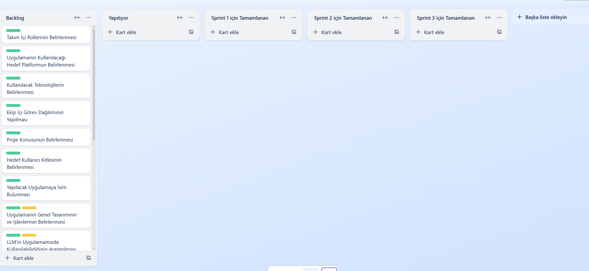

# Takım İle İlgili Bilgiler

## Takım Adı

AI Bootcamp Grup 14

---

## Takım Üyeleri

| İsim Soyisim         | Rolü                     | Github Sayfaları                                |
| :------------------- | :----------------------- | :-------------------------------------------------------- |
| Hakan Yerdraç   | Scrum Master | [GitHub](https://github.com/hyerdrac) 
| Elif Seden Yurtseven   | Product Owner | [GitHub](https://github.com/ElifSeden) 
| Alp Eren Aslan   | Developer | [GitHub](https://github.com/printasln) 
| Sevim Bahadıroğlu   | Developer | [GitHub](https://github.com/sevimbahadiir) 
| Zeynep Ravza Dursun   | Developer | [GitHub](https://github.com/zeynep-ravza) 
 
---
---

# Ürün İle İlgili Bilgiler

  

---

## Ürünün Adı

**HEASZ Healthcare**

---

## Ürünün Açıklaması

HEASZ Healthcare, yapay zekâ teknolojileriyle geliştirilen yenilikçi bir dijital sağlık platformudur. Uygulama, kullanıcıların medikal bilgilere kolayca erişmesini sağlamak ve kişisel sağlık takibini dijital ortamda yönetmesine olanak tanımak amacıyla tasarlanmıştır.

Platform içerisinde yer alan etkileşimli insan modeli, kullanıcıların vücut bölgeleri üzerinden merak ettikleri tıbbi içeriklere açıklayıcı şekilde ulaşmalarını sağlar. Bununla birlikte kullanıcılar, kişisel sağlık verilerini kaydederek, sağlık geçmişlerini takip edebilir ve bireyselleştirilmiş sağlık analizlerine ulaşabilirler.

HEASZ Healthcare, bireylerin sağlık farkındalığını artırmayı, bilgiye erişimi kolaylaştırmayı ve kendi sağlık durumlarını daha etkin yönetmelerine yardımcı olmayı hedefler.

---

## Ürünün Özellikleri

- **İnsan Modeli:** Uygulama üzerindeki interaktif insan modeli sayesinde, vücut bölgelerine göre hastalıklar, semptomlar ve belirtiler hakkında bilgi edinebilirsiniz.  
- **Yapay Zekâ Desteği:** Yapay zekâ desteğiyle güvenilir ve doğru medikal bilgilere kolayca ulaşabilirsiniz.  
- **Kişisel Takip:** Kendi sağlık verilerinizi girerek, size özel analizler ve sağlık önerileri alabilirsiniz.

---

## Ürünün Hedef Kitlesi

- İnsan sağlığı hakkında bilgi edinmek isteyen kullanıcılar
- Kendi sağlığı hakkında merak ettiğini araştırmak isteyen kullanıcılar
- Tıp öğrencileri
- 15 - 65 yaş arası genel kullanıcılar

---

## Product Backlog

[Tüm Backlog ve Sprint Bilgilerine Ulaşmak İçin Tıklayın](https://trello.com/b/mJobAH7M/google-yzta-bootcamp-grup-14)