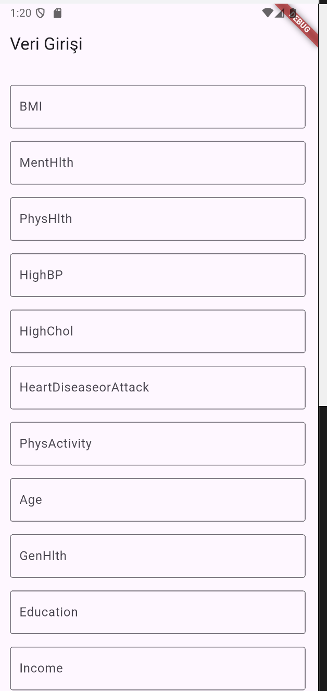

# Takım İle İlgili Bilgiler

## Takım Adı

AI Bootcamp Grup 14

---

## Takım Üyeleri

| İsim Soyisim         | Rolü                     | Github Sayfaları                                |
| :------------------- | :----------------------- | :-------------------------------------------------------- |
| Hakan Yerdraç   | Scrum Master | [GitHub](https://github.com/hyerdrac) 
| Elif Seden Yurtseven   | Product Owner | [GitHub](https://github.com/ElifSeden) 
| Alp Eren Aslan   | Developer | [GitHub](https://github.com/printasln) 
| Sevim Bahadıroğlu   | Developer | [GitHub](https://github.com/sevimbahadiir) 
| Zeynep Ravza Dursun   | Developer | [GitHub](https://github.com/zeynep-ravza) 
 
---
---

# Ürün İle İlgili Bilgiler

  

---

## Ürünün Adı

**HEASZ Healthcare**

---

## Ürünün Açıklaması

HEASZ Healthcare, yapay zekâ teknolojileriyle geliştirilen yenilikçi bir dijital sağlık platformudur. Uygulama, kullanıcıların medikal bilgilere kolayca erişmesini sağlamak ve kişisel sağlık takibini dijital ortamda yönetmesine olanak tanımak amacıyla tasarlanmıştır.

Platform içerisinde yer alan etkileşimli insan modeli, kullanıcıların vücut bölgeleri üzerinden merak ettikleri tıbbi içeriklere açıklayıcı şekilde ulaşmalarını sağlar. Bununla birlikte kullanıcılar, kişisel sağlık verilerini kaydederek, sağlık geçmişlerini takip edebilir ve bireyselleştirilmiş sağlık analizlerine ulaşabilirler.

HEASZ Healthcare, bireylerin sağlık farkındalığını artırmayı, bilgiye erişimi kolaylaştırmayı ve kendi sağlık durumlarını daha etkin yönetmelerine yardımcı olmayı hedefler.

---

## Ürünün Özellikleri

- **İnsan Modeli:** Uygulama üzerindeki interaktif insan modeli sayesinde, vücut bölgelerine göre hastalıklar, semptomlar ve belirtiler hakkında bilgi edinebilirsiniz.  
- **Yapay Zekâ Desteği:** Yapay zekâ desteğiyle güvenilir ve doğru medikal bilgilere kolayca ulaşabilirsiniz.  
- **Kişisel Takip:** Kendi sağlık verilerinizi girerek, size özel analizler ve sağlık önerileri alabilirsiniz.

---

## Ürünün Hedef Kitlesi

- İnsan sağlığı hakkında bilgi edinmek isteyen kullanıcılar
- Kendi sağlığı hakkında merak ettiğini araştırmak isteyen kullanıcılar
- Tıp öğrencileri
- 15 - 65 yaş arası genel kullanıcılar

---

## Product Backlog

[Tüm Backlog ve Sprint Bilgilerine Ulaşmak İçin Tıklayın](https://trello.com/b/mJobAH7M/google-yzta-bootcamp-grup-14)

---

# 1. Sprint

- **Sprint Board Update**

- **Sprint Notları**: User Story, kartların açıklama kısımlarına yazılmıştır.

- **Sprint İçinde Tamamlanması Tahmin Edilen Puan:** 65

- **Puanlama Mantığı:** Proje boyunca toplanacak toplam puan sayısı 215. Kartlar içerisinde bulunan etiketlerin her biri (Sprint 1, Sprint 2, Sprint 3 etiketleri hariç. Bunlar backlog'ların hangi sprint'de gerçekleştirileceğini planlayan etiketlerdir.) +5 puandır. Birden fazla etiket içeren kartlar, etiket sayısının toplam puanına eşittir. (Örneğin iki etiket içeren kartın puanı +10). Sprint Retrospective kartları puanlındırmaya dahil değildir.

- **Daily Scrum:** Daily Scrum'lar whatsapp ve google meets üzerinden gerçekleştirilmiştir. [Görüntüleyin](project_managment_file/sprint_1_daily_scrum/)

- **Sprint Review:** 
  - Sprint 1 sürecinde, proje için genel yol haritası belirlendi ve uygulamanın yapılışı planlandı.
  - LLM ve ML modellerinin görev dağılımı tanımlandı; kullanıcıdan alınacak veriler, bu verilerin işlenme biçimi ve sunulacak çıktıların genel çerçevesi oluşturuldu.
  - Sprint sonunda yapılan değerlendirme toplantısında, ürünün etkileşimli insan modeli ve kişisel sağlık takibi gibi modülleri için ayrı ayrı modül bazlı planlama yapılması gerektiği geri bildirimi alındı. 

- **Sprint Retrospective:**
  - Sprint 1 retrospektifinde, ekip planlama sürecinin verimli geçtiğini ve proje hedeflerinin netleştiğini ifade etti.
  - Ancak bazı kavramların ekip içinde farklı anlaşılması nedeniyle planlama aşamasında zaman kayıpları yaşandığı gözlemlendi. Bu nedenle teknik terimlerin ve kullanılacak modellerin sprint öncesinde net tanımlanmasına karar verildi.
  - Ayrıca toplantıların daha yapısal ilerlemesi gerektiği yönünde görüş birliği oluştu. İkinci sprintte daha kısa süreli ama odaklı planlama ve geliştirmenin birlikte ilerlemesi hedefleniyor.

  
Prototip Ekran Görüntüsü

  
  
  